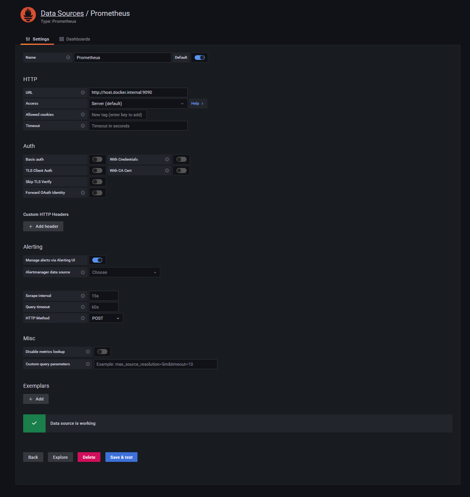
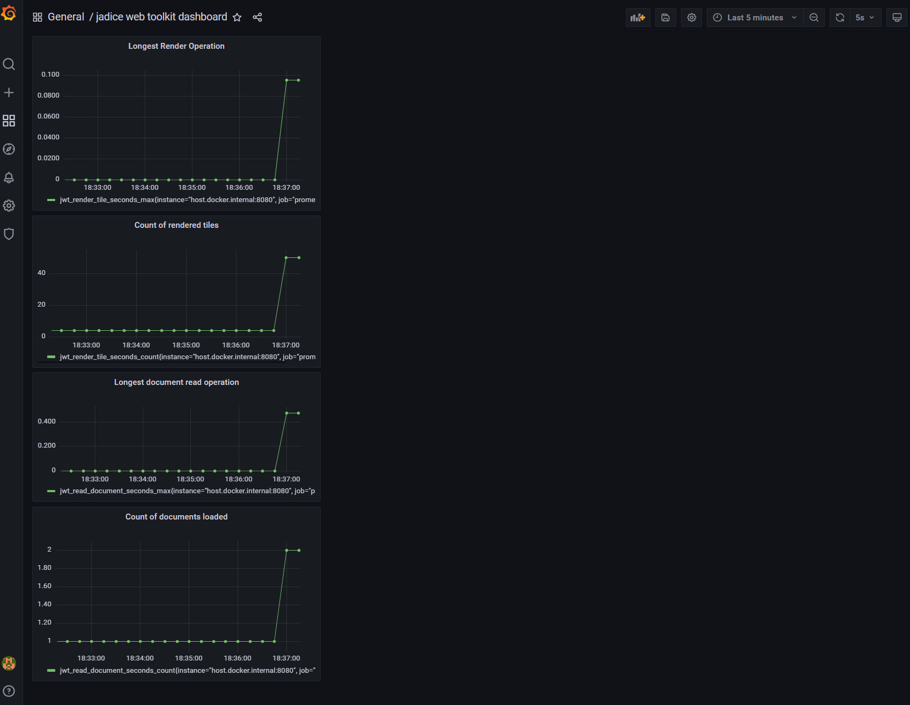

## Howto: setup prometheus and grafana for the jadice web toolkit

### run the application under test (AUT)
1. clone this project "jwt-getting-started" (https://github.com/levigo/jwt-getting-started.git)
2. run the Tutorial 005 like described in https://levigo.de/info/pages/viewpage.action?pageId=153062206
3. the list of exposed metrics via micrometer can be viewed in the browser at http://127.0.0.1:8080/actuator/metrics
4. the prometheus syntax of the same values: http://127.0.0.1:8080/actuator/prometheus

### run grafana and prometheus
#### cloning and running the grafana tutorial
1. clone the grafana tutorial https://grafana.com/tutorials/grafana-fundamentals/
   1. for more info, visit the grafana page to this tutorial: https://grafana.com/tutorials/grafana-fundamentals/
2. within the cloned grafana tutorial, replace the **prometheus/prometheus.yml** there with the one residing in this project(
    same directory as this README.md: **src/test/resources/prometheus.yml**)
3. like described in the tutorial, start the services:
   1. **docker-compose up -d**

#### configuring grafana: data source
5. visit **localhost:3000**
6. login with **admin** for both user and password
7. create a data source at **http://127.0.0.1:3000/datasources**
8. type: **Prometheus**
9. ***Important!*** use **"Prometheus"** as name, because the dashboard imported in the next steps
   expects exactly this name
10. set the *URL*: it **must** evaluate to **http://host.docker.internal:9090**
11. click **Save & test** -> a green checkmark with the message "Data source is working" should appear.
12. 

#### configuring grafana: dashboard
11. go to **http://127.0.0.1:3000/dashboards**
12. click **import**
13. click **Upload JSON file** and use the json file in this directory:
    1. **src/test/resources/jadice web toolkit dashboard-1659536713449.json**
14. You should be able to see 4 metrics now in the dashboard
15. 

